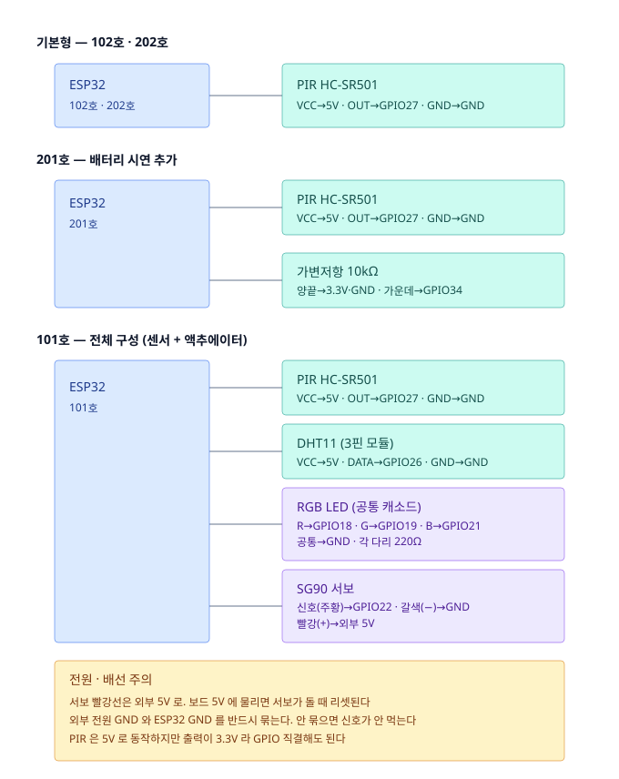

# 아두이노 배선 규격 — 전시 구성 (2026-09-21 개정)

보드는 **ESP32 한 종류**만 쓴다. 스케치도 `home_node/home_node.ino` 하나로,
세대마다 `HOME` 과 `HAS_*` 플래그만 바꿔서 굽는다.

스케치의 핀 상수는 반드시 이 문서와 일치시킬 것.

## 보드 배치

1층·2층으로 나눈 이유: 세대가 한 줄이면 범위 규칙("2층만 기준 다르게")을 보여줄 수가 없다.

| 세대 | 부품 | 시연 장면 |
|---|---|---|
| **101호** | PIR + DHT11 + RGB LED + 서보 | 관람객이 손을 흔든다 → 정상 / 제어 규칙 |
| **102호** | PIR | 가만히 둔다 → 주의 → 긴급 (단계 경보) / 부재 등록 |
| **201호** | PIR + 가변저항 | 노브를 돌린다 → 배터리 부족 |
| **202호** | PIR | **처음엔 꽂지 않는다.** 발표 중 꽂으면 2층에 세대가 는다 → 그대로 뽑으면 통신 두절 |

202호가 두 장면을 겸한다. 보드가 하나 덜 들고, 이야기도 "입주 → 사고"로 자연스럽게 이어진다.

예비 보드 1대와 예비 PIR 1개는 반드시 따로 둔다. 전시 중에 하나 죽으면 그걸로 끝이다.

## 스케치 설정

`home_node.ino` 상단의 **`#define BOARD` 한 줄만** 고친다.
세대와 부품 조합은 스케치 안의 표가 정하므로, 플래그를 따로 맞출 필요가 없다.

| 굽는 순서 | 고칠 줄 | 세대 | 달린 것 |
|---|---|---|---|
| 1번째 | `#define BOARD 1` | 101호 | PIR + DHT11 + RGB LED + 서보 |
| 2번째 | `#define BOARD 2` | 102호 | PIR |
| 3번째 | `#define BOARD 3` | 201호 | PIR + 가변저항 |
| 4번째 | `#define BOARD 4` | 202호 | PIR |

보드 뒷면에 번호를 적어두면 나중에 어느 게 몇 호인지 헷갈리지 않는다.

`REPORT_S` 는 전시에서 5초. 서버의 두절 판정 임계는 `3 × REPORT_S` = 15초로 자동 계산된다.
이 값은 라벨에 실려 나가므로 **서버 코드는 손댈 필요가 없다.**

필요한 라이브러리:
- `HAS_DHT` → Adafruit **DHT sensor library**
- `HAS_ACTUATOR` → **ESP32Servo**
- esp32 보드패키지 **3.x 이상** (`analogWrite` 가 3.x 부터 지원. 2.x 면 컴파일이 막힌다)

## 배선도



## 핀 연결

### 공통 — PIR (네 보드 전부)

| 부품 핀 | ESP32 핀 | 비고 |
|---|---|---|
| VCC | **5V (VIN)** | PIR 은 5V 로 동작 |
| OUT | **GPIO 27** | 출력이 3.3V 라 직결해도 된다 |
| GND | GND | |

### 201호 추가 — 가변저항 10kΩ (배터리 모사)

| 부품 핀 | ESP32 핀 | 비고 |
|---|---|---|
| 양끝 한쪽 | **3.3V** | ⚠️ 5V 금지 — ADC 입력 범위를 넘는다 |
| 양끝 반대 | GND | |
| 가운데 | **GPIO 34** | 입력 전용 ADC1 핀. WiFi 와 충돌 없음 |

### 101호 추가 — DHT11 (3핀 모듈)

| 부품 핀 | ESP32 핀 | 비고 |
|---|---|---|
| VCC | 5V | |
| DATA | **GPIO 26** | 4핀 bare 제품이면 VCC-DATA 사이 10kΩ 풀업 |
| GND | GND | |

### 101호 추가 — RGB LED (공통 캐소드)

| 부품 핀 | ESP32 핀 | 비고 |
|---|---|---|
| R 다리 | **GPIO 18** | 각 다리에 **220Ω 직렬** |
| G 다리 | **GPIO 19** | |
| B 다리 | **GPIO 21** | |
| 공통(긴 다리) | GND | |

공통 애노드 제품이면(불이 안 켜지고 반대로 동작) 긴 다리를 3.3V 로 옮기고
스케치의 `LED_COMMON_ANODE` 를 `true` 로 바꾼다.

### 101호 추가 — SG90 서보

| 부품 핀 | 연결 | 비고 |
|---|---|---|
| 주황(신호) | **GPIO 22** | |
| 빨강(+) | **외부 5V** | ⚠️ 보드 5V 금지 |
| 갈색(−) | GND | **외부 전원 GND 와 ESP32 GND 를 공통으로 묶을 것** |

> UNO 핀(3/5/6/9)을 그대로 옮기면 안 된다. ESP32 는 GPIO 6~11 이 플래시 전용,
> GPIO 3 은 시리얼, GPIO 5 는 부팅 스트래핑 핀이다.
> UNO R4 용 핀 정의는 스케치의 `#else` 에 남아 있어 UNO 로도 그대로 굽힌다.

## 함정 (겪은 것들)

1. **WiFi 는 2.4GHz 만.** 학교 와이파이는 로그인 페이지 때문에 안 된다 → 핸드폰 핫스팟.
   보드 4대가 한 핫스팟에 붙으므로 동시접속 한도를 미리 확인하고, **발표용 폰은 따로 둔다.**
2. **서보와 LED 가 LEDC 타이머를 같이 쓴다.** 타이머를 떼어주지 않으면
   LED 는 켜지는데 **서보만 조용히 안 돈다.** 스케치에서 `ESP32PWM::allocateTimer(0)` 로 처리했다.
   서보 가동 범위가 0~180도가 안 나오면 `servo.attach(SERVO_PIN, 500, 2400)` 의 숫자를 조정한다.
3. **PIR 은 전원 인가 후 30~60초 안정화.** 부스 열기 전에 미리 켜둔다.
4. **PIR 모듈의 가변저항 2개**(감도·지연) 중 **지연을 최소로.** 기본값이면 한 번 감지 후
   몇 초간 계속 HIGH 라 반응이 둔해 보인다.
5. **선 빠짐이 사고 1순위다.** 보드와 브레드보드를 폼보드에 고정하고,
   여유가 되면 PIR 3선만이라도 납땜한다.
6. **202호 USB 는 손 닿는 곳에.** 뽑았다 꽂는 시연을 하므로 케이블을 묶어버리면 안 된다.
7. **전원은 멀티 USB 충전기로.** 노트북 포트가 모자라고, 보드 리셋이 노트북에 영향을 준다.
   (업로드할 때만 노트북에 연결)
8. DHT11 은 부팅 후 첫 1~2초 판독 실패가 정상이다 (NaN 이면 건너뛴다).
9. **Windows 사용자 이름이 한글이면 ESP32 컴파일이 마지막 링크에서 실패한다.**
   (`ld.exe: cannot open output file C:\Users\???\...` 또는 `cannot find -lxtensa`)
   코드 문제가 아니다 — ESP32 링커가 한글 경로(`C:\Users\<한글>\AppData\Local\Arduino15`)를 못 읽는다.
   UNO R4 는 괜찮다. 가장 쉬운 방법은 **사용자 이름이 영문인 PC 에서 굽는 것.**
   그 PC 에서 꼭 구워야 하면 PowerShell 에서 같은 폴더를 드라이브 문자로 잡아 IDE 에 들어 있는 arduino-cli 로 굽는다
   (`COM3` 은 장치 관리자에서 본 포트로, 경로는 저장소 맨 위 기준):

   ```powershell
   subst R: "$env:LOCALAPPDATA"
   $env:ARDUINO_DIRECTORIES_DATA = "R:\Arduino15"
   & "$env:LOCALAPPDATA\Programs\Arduino IDE\resources\app\lib\backend\resources\arduino-cli.exe" compile --fqbn esp32:esp32:esp32 --build-path R:\onsalpim_build -u -p COM3 arduino\home_node
   subst R: /d
   ```

   2026-09-25 에 이 방법으로 BOARD 1~4 컴파일까지 확인했다 (업로드 `-u -p` 는 보드가 없어 확인 전).

## 플랫폼 컨테이너

보드가 켜질 때 스스로 만든다. **세대 컨테이너를 먼저 만들고 그 아래에 장치를 만든다.**
장치가 무엇인지는 장치 라벨로, 어느 세대인지는 부모 컨테이너의 `home=` 으로 서버가 알아낸다(`iot_platform.read_tree` 가 물려준다).
서버 코드에 장치 목록은 없다.

| CNT (경로) | 생성 조건 | lbl |
|---|---|---|
| `h{HOME}` | 항상, 가장 먼저 | `home={HOME}` — 세대 표시는 여기에만 |
| `h{HOME}/pir` | 항상 | `kind=sensor, type=motion, values=0\|1, report_s={N}` |
| `h{HOME}/evt` | 항상 | `kind=event, type=motion, role=activity` |
| `h{HOME}/temp` · `h{HOME}/humi` | `HAS_DHT` | `kind=sensor, type=temperature` / `humidity` |
| `h{HOME}/batt` | `HAS_BATT` | `kind=sensor, type=battery, unit=%` |
| `h{HOME}/led` · `h{HOME}/window` | `HAS_ACTUATOR` | `kind=actuator, type=light, accepts=ON\|OFF` / `type=window, accepts=range=0~180` |

이미 있는 컨테이너는 다시 만들지 않는다(409). 라벨(예: `report_s`)을 바꿔 다시 구웠으면 서버에서 그 컨테이너를 지우고 다시 꽂아야 새 라벨이 붙는다.
예전 한 층 구조(`h101_pir`, 고정 이름 `led_cmd`·`servo_cmd`)가 서버에 남아 있으면 `python virtual_home.py --remove 101 102 201 202 --legacy` 로 목록을 보고 정리한다.

`pir` 은 움직임이 있든 없든 `REPORT_S` 마다 올린다 → **장치가 살아있다는 증거.**
`evt` 는 움직임이 0→1 로 바뀔 때만 올린다 → **사람이 움직였다는 증거.**
이 둘을 나눠야 '무활동'과 '통신 두절'을 구분할 수 있다. 합치면 값이 안 오는 게 둘 중 뭔지 영원히 알 수 없다.

## 구버전 — 보드 A/B (2026-07-20)

`archive/board_a`, `archive/board_b` 는 세대 구분이 없던 시절의 스케치다.
같은 폴더의 `dht_test`, `servo_test` 는 UNO 핀 기준 단품 시험이라 ESP32 에서는 그대로 안 돈다.
UNO R4 두 대에 센서(PIR/DHT11/RFID-RC522)와 액추에이터(서보/RGB LED)를 나눠 붙이고
컨테이너 이름도 `pir`, `temp`, `led_cmd` 처럼 세대 없이 썼다.

전시에는 쓰지 않는다. 참고용으로만 남겨둔다 — 핀 배치는 위의 UNO R4 `#else` 블록과 같고,
RC522 는 **3.3V 전용**(5V 연결 시 칩 손상)이라는 점만 따로 기억해 둘 것.
